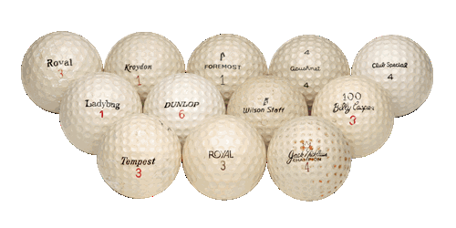
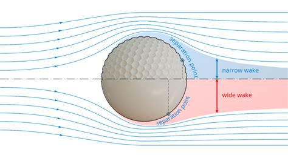
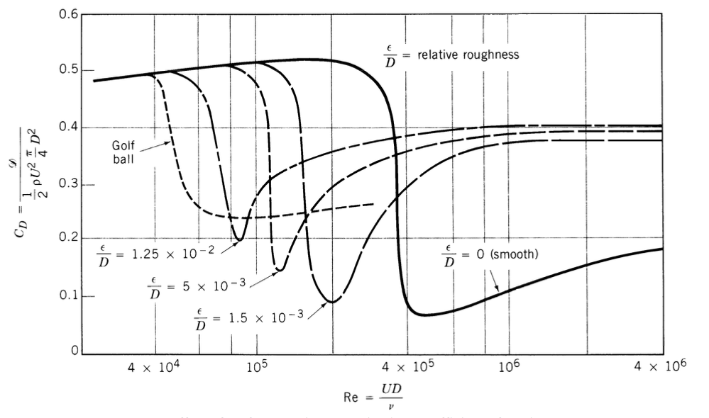
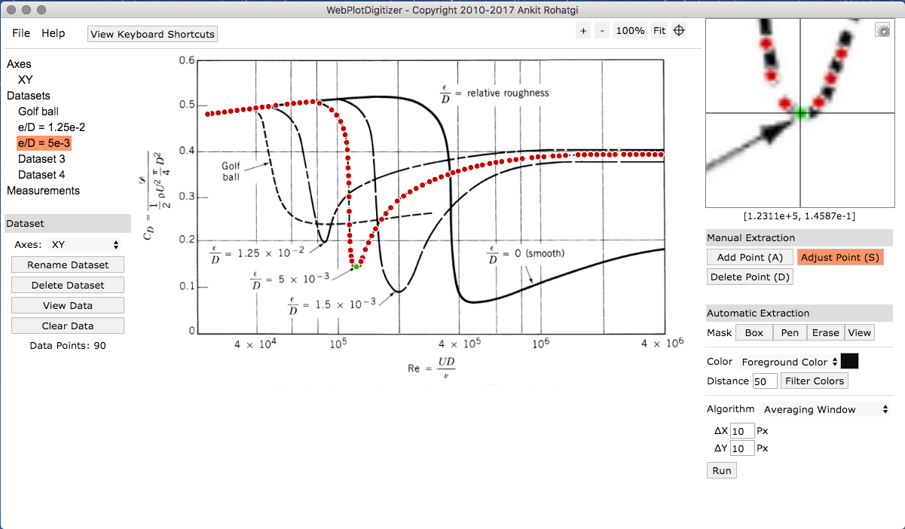
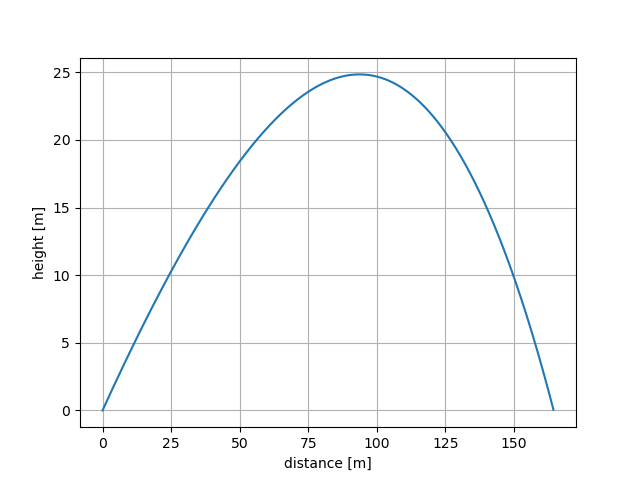
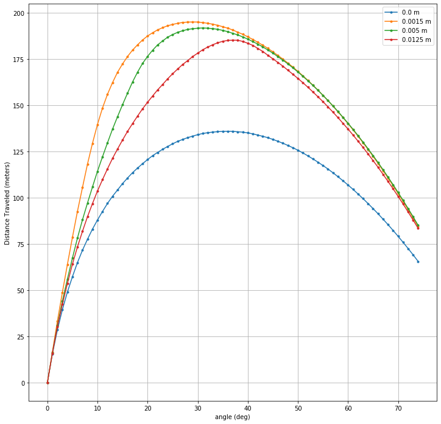
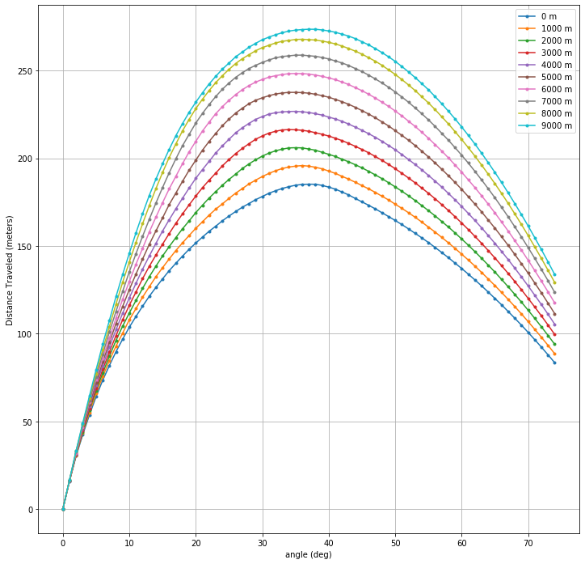

Welcome to golfball
===================

.. include:: ../README.rst
  :start-after: inclusion-marker-short-desc-start
  :end-before: inclusion-marker-short-desc-end

What is a "Drag Crisis?"
------------------------

The Drag Crisis is a nonlinearity phenomenon that happens when flow detaches
and and becomes turbulent around a sphere at a specific Reynolds number (Re).
This is why golf balls have dimples -- to reduce the turbulent wake width by
moving the separation point further aft on the sphere therefore reducing drag,
increasing the ballistic coefficient, and ultimately resulting in increased
distance of flight.

The following plot shows how this wake narrowing drag reduction effect varies
with dimple size and Reynolds number:

The Drag on the ball varies in flight, predominantly as a function of its
speed. A golf ball in flight starts on the left of the drag crisis, transitions
through the drag reduction, and if velocity drops low enough, it could
transition back to the low-speed/high-drag regime. This drag variation makes
this model interesting for mapping uncertainty in initial conditions through to
trajectory performance.

We digitized these curves from this plot using the open
source tool `WebPlotDigitizer`_.

Model parameterization
-----------------------

This nonlinear drag model is used with the SciPy ODE Solver from the
scipy.integrate package to compute 2D trajectories, parameterizing the initial
conditions by

+ initial height (also used as end height)

+ initial lateral position

+ initial launch (flight path) angle

+ initial velocity

the ball is parameterized with the following inputs:

+ dimple size

+ ball mass

+ ball cross-sectional Area

the environment is parameterized with the following inputs:

  + gravity

  + initial height (same as above, used as ref altitude for atmosphere model)

  + wind vector (constant everywhere as of v1.0)

Note that this model does not capture the Magnus effect -- lift from a spinning
cylindrical/spherical object.  This is a proposed future enhancement to add to
the model.

Trajectory characteristics
--------------------------

The trajectories take on the traditional drag-body ballistic shape:

Nonlinear sensitivities
-----------------------

The model has varying performance with dimple size, as seen by the results of
the following sensitivity analysis of hit distance vs. initial launch angle for
each of the dimple sizes digitized in the model:

For added dimensionality, we also added a varying density/temperature profile
with altitude, in the form of the 1976 U.S. Standard Atmosphere, which is
illustrated in the following figure showing the sensitivity analysis of hit
distance vs. initial launch angle with varying base altitudes:

Have fun exploring and enhancing this parameterized nonlinear dynamics model!

.. toctree::
   :maxdepth: 2
   :caption: Contents:

   install
   quickstart
   examples
   developers
   modules
   changelog
   license
   authors
   kudos
   contributing

Indices and tables
==================

* :ref:`genindex`
* :ref:`modindex`

.. Links and References

.. _WebPlotDigitizer: https://automeris.io/WebPlotDigitizer/
